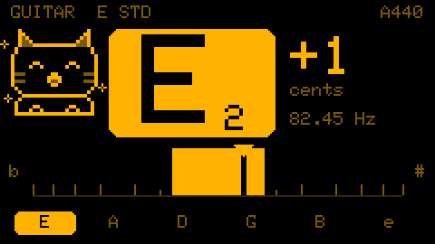
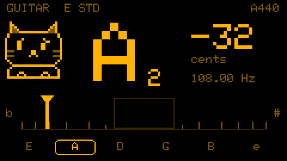
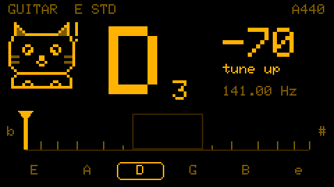
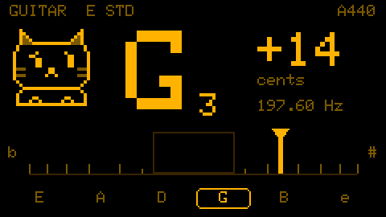
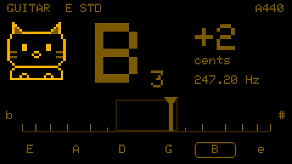
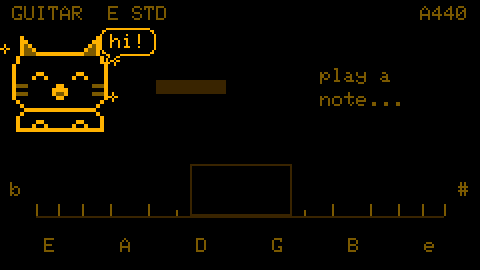
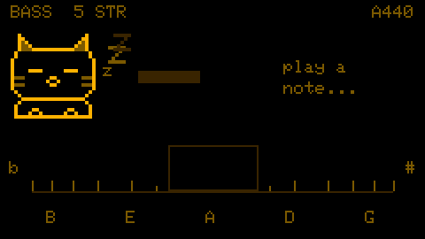
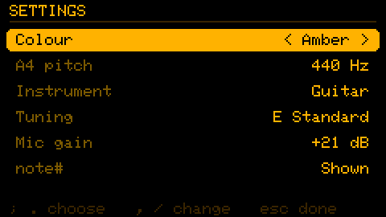

# card-tuner

A pocket guitar and bass tuner for the **M5Stack Cardputer ADV**, starring **note#**, a little pixel cat who reacts to your tuning.

It uses the Cardputer ADV's built-in mic, so nothing needs to be bought or soldered.

<p>
  
  
</p>

## Features

- **Guitar and bass tuner** that works down to a 5-string bass's low B (31 Hz), using only the built-in mic
- **Note, cents and frequency** readout with a needle meter that is stretched near the centre for fine tuning
- **Tuning presets** for guitar and bass. The tuner aims at the nearest string and says "tune up" or "tune down" when you're way off
- **Adjustable A4** reference (430–450 Hz)
- **One-colour look:** black background with a single accent colour (Amber by default; also White, Phosphor, Cyan, Pink, Lavender and Red)
- **note# the cat**, who reacts to how you're doing
- **Settings saved to flash**, so they survive a power cycle

## Meet note#

| | |
|---|---|
|  |  |
| **In tune:** the note box and centre zone fill solid, the string is ticked off in the row below, and note# bounces with sparkles. | **Flat:** note# leans and looks worriedly towards the needle. |
|  |  |
| **Way off:** more than 50 cents from the string, note# is startled and the tuner tells you which way to turn. | **Sharp:** the same worried look, the other way. |
|  |  |
| **Held:** when a note fades, its last reading stays on screen, dimmed, for a moment. | **Say hi:** press `n` and note# says something. |

Leave the tuner quiet for a few seconds and note# falls asleep.

## Controls

### Tuner

| Key | Action |
|---|---|
| `g` / `b` | Guitar / bass |
| `,` / `/` (← / →) | Previous / next tuning preset |
| `c` | Chromatic mode (any note, no target string) |
| `-` / `=` | A4 pitch down / up |
| `s` | Settings |
| `n` | Say hi to note# |
| `r` | Record 3 s of audio for `tools/capture.py` (development) |

With a preset, the big note is the string you're nearest to, and the cents are measured against it. The string row along the bottom boxes that string, and strings that have been in tune get a dot.

### Presets

**Guitar:** E standard, Drop D, Eb standard, D standard, Drop C, DADGAD, Open G, Open D, 7-string.
**Bass:** E standard, Drop D, Eb standard, D standard, 5-string BEADG, 6-string BEADGC.



### Settings



`;` / `.` (↑ / ↓) choose a row, `,` / `/` (← / →) or Enter change it, Esc or `s` to go back. Colour previews live as you change it. Everything is saved to flash.

## How it works

Pitch detection uses the **YIN** algorithm, which works on the raw waveform. A small mic barely picks up a bass's fundamental, but the waveform still repeats at the fundamental's period. YIN finds that period, so it reports the right note where picking the loudest frequency (an FFT peak) would read an octave high.

- **Detector:** 16 kHz sampling and a ~107 ms analysis frame (two of the longest periods searched). The period is interpolated across several cycles at once for sub-cent precision. Each analysis takes about 5 ms on the ESP32-S3, using ESP-DSP's SIMD dot product, and runs every 25 ms.
- **Search range:** guitar mode only searches down to 55 Hz, which makes its frames shorter and faster and avoids mistaking a note for the octave below.
- **Steady display:** a new note has to persist for 75 ms before it's shown, so key clicks and one-off octave errors are ignored. Readings are a 7-frame median eased into the display. "In tune" needs 0.3 s within ±3 cents, and only switches off again past ±5 cents.

## Hardware

- M5Stack Cardputer ADV (ESP32-S3, ES8311 codec, MEMS mic, 240×135 display, I2C keyboard)

## Building

1. Install [VS Code](https://code.visualstudio.com/) and the **PlatformIO IDE** extension.
2. Open this folder in VS Code.
3. Connect the Cardputer ADV over USB-C.
4. Run **PlatformIO: Upload** (or `pio run -t upload`).

If upload fails, put the device in download mode: hold **G0** while plugging in USB.

Uploading replaces whatever firmware is on the Cardputer, such as M5 Launcher. To keep Launcher instead, copy `.pio/build/cardputer/firmware.bin` to the SD card and install it from Launcher.

## Testing

The pitch detector, note maths and display smoothing have no hardware dependencies. They're tested on the PC against synthetic tones and real recordings (39 tests). This needs a host C++ compiler on PATH, for example `winget install BrechtSanders.WinLibs.POSIX.UCRT`.

```
pio test -e native
```

### Recording test audio

The firmware can stream 3 s of mic audio to the PC. With the device connected (and the serial monitor closed):

```
~/.platformio/penv/Scripts/python.exe tools/capture.py COM5 guitar_low_e --wait
```

Pluck the string, then press `r` on the Cardputer. The recording is saved to `recordings/guitar_low_e.wav`.

To see what the detector makes of a recording, frame by frame:

```
g++ -O2 -std=c++17 -Isrc tools/pitch_scan.cpp src/pitch.cpp -o .pio/pitch_scan
.pio/pitch_scan recordings/speaker_bass_e.wav
```

### Screenshots and serial commands

```
~/.platformio/penv/Scripts/python.exe tools/screenshot.py COM5 docs/images/example.png --scale 2
```

Other serial commands: `l` toggles a per-frame detector log, `d` cycles demo readings (to screenshot each state without live audio), `S` opens settings, `H` replays the splash, and `R` resets settings to defaults. Any other character acts as that key on the keyboard.

## Project layout

```
src/
  main.cpp          setup/loop, input, serial commands
  audio_in.*        mic → ring buffer
  pitch.*           YIN pitch detection (no hardware deps, unit-testable on PC)
  tuning.*          frequency → note/cents, tuning presets
  tracker.*         smoothing, outlier rejection, hold and in-tune detection
  theme.*           accent colour and its dim/faint shades
  tuner_ui.*        tuner screen
  cat.*             note# sprites and animation
  settings.*        persistent settings (NVS)
  settings_ui.*     settings screen
  debug_dump.*      stream mic audio and screenshots over serial
test/
  test_pitch/       detector tests on synthetic and recorded signals
  test_tuning/      note/cents conversion and presets
  test_tracker/     smoothing, hold and in-tune
tools/
  capture.py        save a mic recording from the device as WAV
  pitch_scan.cpp    print detector output frame by frame for a WAV
  screenshot.py     save the device's screen as a PNG
recordings/         test audio captured on the device
docs/images/        screenshots for this README
```

## Roadmap

- [x] **M0** Scaffold: text on screen, key presses register, beep
- [x] **M1** Mic level meter and raw sample dump
- [x] **M2** YIN pitch detection passing native unit tests (synthetic tones 31–988 Hz, missing fundamental, bass recordings)
- [x] **M3** Tuner v1 on device: note, Hz, cents (5 ms per frame using ESP-DSP SIMD)
- [x] **M4** Tuner UI: theme, needle meter, in-tune inversion, smoothing, outlier rejection, hold
- [x] **M5** Settings screen saved to flash; tuning presets with target string
- [x] **M6** note# the cat: pixel sprites reacting to the tuning, splash screen
- [ ] Record real guitar and bass (so far the test recordings are a bass played through a speaker)
- [ ] *Maybe later:* tuning light on the RGB LED (the ADV's LED doesn't light up yet)
- [ ] *Maybe later:* reference tone through the speaker/headphones
